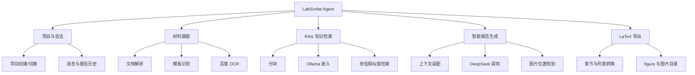
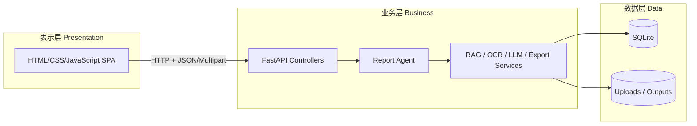
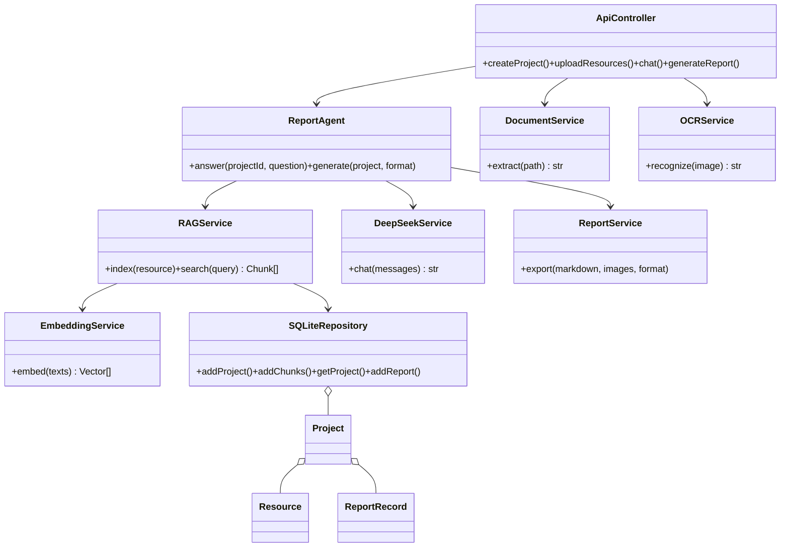
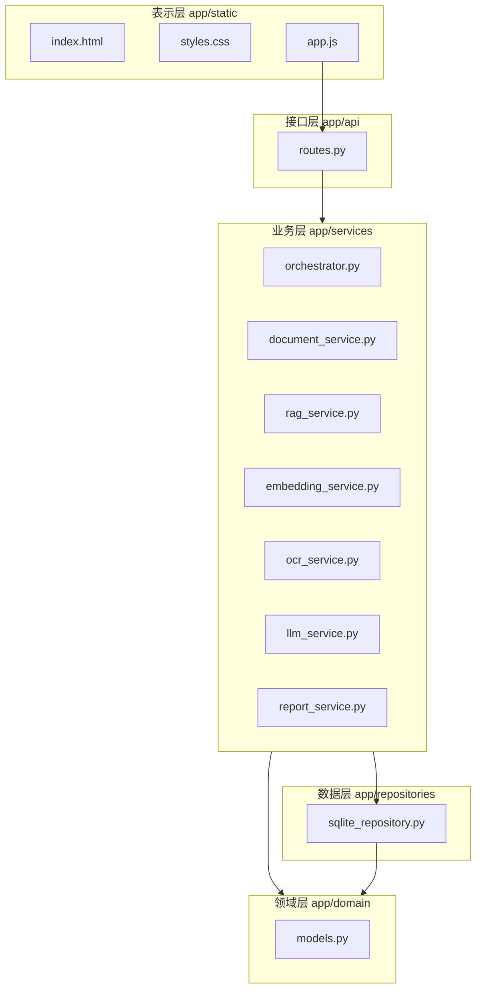
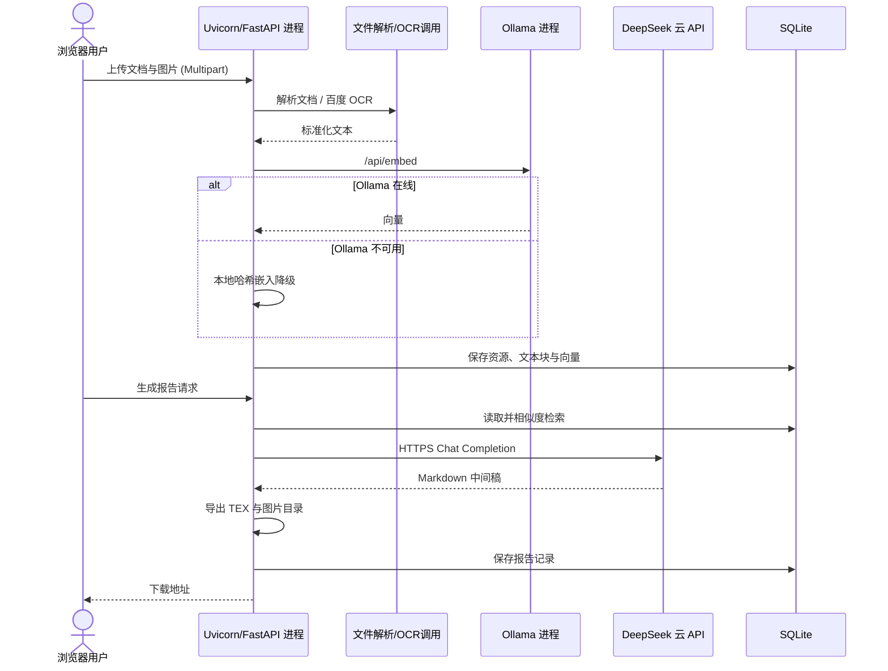
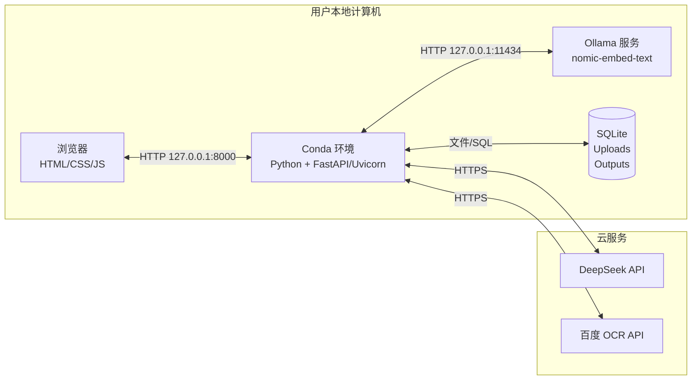
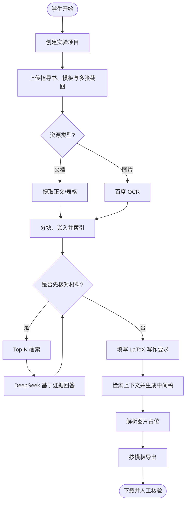

# LabScribe Agent 实验报告编写助手体系结构设计文档

> 课程：软件体系结构　　姓名：________　　学号：________　　日期：2026 年 6 月

## 摘要

高校实验报告往往同时依赖实验指导书、代码、运行日志、数据表、截图和指定模板。传统通用聊天模型无法稳定追踪材料来源，也难以保持 LaTeX 模板与图片位置的一致。本文设计并实现 LabScribe Agent：一个基于三层 B/S 体系结构的实验报告编写智能体。系统以 FastAPI 提供业务接口，以原生 Web 页面提供 ChatGPT 风格交互，以 SQLite 和工作区文件系统保存数据；通过 Ollama 生成向量、轻量向量检索完成 RAG，通过百度云 OCR 理解多张截图，通过 DeepSeek V4-Pro 思考模式进行问答和结构化报告规划，并输出包含图片引用的 LaTeX 源码。

系统的关键设计目标是“材料有依据、能力可替换、Demo 可运行”。外部能力均封装在适配器中；Ollama 不可用时可回退到本地哈希嵌入，因此材料仍可建立索引。系统不会把 OCR 或模型连接失败伪装成成功结果，而是在前端显示可诊断错误。

**关键词：** 软件体系结构；智能体；RAG；OCR；三层 B/S；4+1 视图

## 1. 项目背景与用户需求

### 1.1 应用场景与目标用户

目标用户是需要完成课程实验、课程设计或科研实验记录的高校学生。用户通常拥有一份实验指导书、一份教师提供的报告模板、若干运行截图和零散结果数据。系统帮助用户把这些异构材料组织为结构规范、可继续编辑的实验报告，但不替代用户核验实验数据。

### 1.2 角色与利益相关者

| 角色 | 关注点 |
|---|---|
| 学生用户 | 上传方便、回答有依据、报告格式正确、图片位置合理 |
| 教师/助教 | 报告结构规范、数据不被虚构、过程可演示 |
| 开发维护者 | 模块低耦合、外部 API 可替换、易调试和扩展 |
| 系统管理员 | 本地部署简单、依赖数量可控、敏感配置可管理 |

### 1.3 功能性需求

| 编号 | 需求 | 验收标准 |
|---|---|---|
| FR-01 | 实验项目管理 | 可新建并切换项目，项目之间材料隔离 |
| FR-02 | 多格式材料读取 | 支持 DOCX、LaTeX、PDF、TXT、Markdown 等文本提取 |
| FR-03 | 模板读取 | 可将 TEX 标记为模板，输出时应用模板结构 |
| FR-04 | 多图片 OCR | 一次上传多张图片，调用百度 SDK 提取中英文文字 |
| FR-05 | RAG 索引与问答 | 文档切块、向量化、相似度检索，回答附材料来源 |
| FR-06 | 报告智能生成 | DeepSeek V4-Pro 基于检索材料与模板章节生成结构化报告，不虚构数据 |
| FR-07 | 图片插入 | LaTeX 生成 figure 引用和配套图片目录 |
| FR-08 | LaTeX 导出 | 可下载 TEX 文件，并保留可编辑源代码 |
| FR-09 | 历史记录 | 保存对话和已生成报告，刷新页面后仍可查看 |
| FR-10 | 服务状态提示 | 显示 DeepSeek/OCR 配置与 Ollama 在线状态 |

### 1.4 核心交互流程

1. 用户新建实验项目。
2. 用户上传实验材料、多张截图和可选模板。
3. 系统解析文档；图片先经 OCR，文字与文档内容一起切块并嵌入向量库。
4. 用户可通过对话提出问题。系统检索相关片段，DeepSeek 严格依据片段回答并返回引用。
5. 用户填写写作要求、图片安排和高级提示词。报告智能体检索上下文、提取模板章节，并让 V4-Pro 生成包含章节和图片归属的 JSON 计划。
6. 导出器把中间稿映射为 LaTeX 章节与 figure，保存并提供下载。

### 1.5 非功能性需求

- **易用性：** 单页式工作区，主要任务不超过三次操作；错误使用中文描述。
- **响应性：** 本地项目查询在 500 ms 内完成；耗时 AI 调用给出加载状态。
- **可扩展性：** LLM、嵌入、OCR、存储和导出均通过独立服务类隔离。
- **可靠性：** 上传文件使用项目独立目录；输出历史持久化；外部服务故障可诊断。
- **可维护性：** 表示层、业务层、数据层只沿规定方向依赖；业务服务单一职责。
- **安全性：** 文件名去除目录成分，限制单文件大小；`.env` 不纳入版本控制；发布代码前应轮换课程 Demo 密钥。
- **可移植性：** Windows/macOS/Linux 均可用 Conda 创建环境；本地只依赖 Python 与可选 Ollama。

## 2. 功能分解

### 2.1 顶层功能模块



### 2.2 模块职责与接口

| 模块 | 核心职责 | 输入/输出 |
|---|---|---|
| API Routes | 参数校验、HTTP 状态映射、调用业务服务 | JSON/Multipart → JSON/File |
| DocumentService | 解析文档并归一化文本 | Path → Text |
| OCRService | 使用课程提供的 BaiduAi SDK 识图 | Image → OCR Text |
| EmbeddingService | 调用 Ollama；故障时确定性降级 | Text[] → Vector[] |
| RAGService | 分块、写入向量、Top-K 检索 | Query → Relevant Chunks |
| DeepSeekService | V4-Pro 思考模式、JSON 输出、超时和错误转换 | Messages → Structured Completion |
| ReportAgent | 感知、检索、决策、执行的业务编排 | Project → ReportRecord |
| ReportService | 中间 Markdown 转 LaTeX | Markdown + Images → TEX + Assets |
| SQLiteRepository | 项目、资源、向量、消息、报告持久化 | Domain Object ↔ SQLite |

### 2.3 依赖约束

表示层只通过 HTTP 使用 API；API 不直接写 SQL，而调用业务服务和仓储；业务服务可依赖抽象意义上的仓储和外部适配器；数据层不知道前端和 HTTP 的存在。`ReportAgent` 负责流程编排，但不负责文档解析、网络协议或文件排版，以避免形成“上帝类”。

## 3. 软件体系结构风格设计

### 3.1 三层 B/S 风格

系统采用三层 B/S 作为总体风格：浏览器中的表示层、FastAPI 业务逻辑层、SQLite/文件系统数据层。该风格与本地 Web Demo 匹配，浏览器零安装，后端集中复用 AI 能力，数据访问也能统一管理。



**优点：** 职责清晰、易测试、易替换前端或数据库；部署简单；API 也能被未来移动端复用。**缺点：** 小型项目类和接口数量有所增加；同步生成报告时业务进程会等待外部 API。后续可引入任务队列缓解长任务问题。

### 3.2 仓储（Repository）风格

系统把 SQLite 作为共享仓储，项目元数据、文档块向量、对话和报告记录由统一仓储访问。对当前小项目而言，它免运维、事务完整、备份简单，优于部署独立向量数据库。向量以 JSON 存储并在内存计算余弦相似度；规模达到数十万块后，可在不改变业务 API 的情况下替换为 Chroma、FAISS 或 pgvector。

### 3.3 管道—过滤器风格

材料处理体现管道—过滤器：`上传 → 类型判断 → 文档解析/OCR → 文本归一化 → 切块 → 嵌入 → 持久化`。每个过滤器处理一种转换，便于独立测试和替换。报告生成则为 `检索 → 提示装配 → LLM 草拟 → 图片占位解析 → 格式导出`。

### 3.4 风格适配性总结

三层风格解决系统静态职责划分，仓储风格解决数据一致性，管道—过滤器解决材料处理和报告生成流程。三者并非互斥：它们分别作用于系统层次、数据协作和处理过程，组合后既适合课程 Demo，也保留真实演进路径。

## 4. 智能体设计模式分析

### 4.1 RAG（检索增强生成）模式

**问题：** 大模型不知道用户私有实验材料，直接让模型写报告容易产生幻觉。**方案：** 智能体先将材料向量化；问答或生成前，根据任务检索 Top-K 片段，把片段及来源加入提示。**系统应用：** `RAGService.search` 以余弦相似度返回材料片段，问答结果显示文件名、相似度和摘要。报告生成检索较多片段，覆盖目标、步骤、数据与 OCR 结果。

该模式改善事实可追溯性并降低上下文长度。局限是检索质量受分块与嵌入模型影响；因此系统保留来源信息，并要求模型在证据不足时明确说明。

### 4.2 Tool Use（工具使用）模式

**问题：** 单个模型既不能直接可靠读取二进制 Word 材料，也不应自行模拟 OCR 或文档排版。**方案：** 把能力封装为确定性工具，由编排器选择和组合。**系统工具：** 文档解析器、百度 OCR、Ollama 嵌入、SQLite 检索和 LaTeX 导出器。模型负责语言推理，工具负责可验证的输入输出操作。

工具模式降低模型负担，并使外部服务可替换。例如百度 OCR 可以替换为 PaddleOCR，业务流程不必重写。

### 4.3 Planner–Executor（计划—执行）模式

报告生成不是一次随意对话，而是有明确阶段的目标任务。`ReportAgent` 充当 Planner：提取模板顶层章节，把每张图片绑定到稳定 ID、原文件名、尺寸和 OCR 文本，要求 V4-Pro 返回经过 JSON Schema 校验的章节与图片归属计划。`ReportService` 作为 Executor，整体替换模板示例正文，确定性生成段落、标题、ASCII 图片路径、`figure` 与文件。计划与执行分离后，模型不能直接写磁盘，也不能产生任意路径；漏分配的图片会被系统补入结果或截图章节。

### 4.4 Guardrails（护栏）模式

系统提示明确要求“不虚构实验数据、信息不足时说明”；API 对文件大小、项目存在性和输出格式进行校验；文件名经 `Path.name` 去除目录穿越；外部服务错误转为可见的 502 信息。这些护栏共同约束智能体的输入、推理和执行边界。

## 5. 4+1 视图分析

按照课程课件，逻辑视图服务最终用户的功能需求；开发视图表现模块组织；进程视图关注并发、通信和运行特性；物理视图描述软件到硬件节点的映射；场景视图以关键用例把四种视图串联。

### 5.1 逻辑视图（类/组件图）



该视图保持单一、内聚的领域对象模型。`Project` 聚合资源、消息和报告；服务以组合方式协作，不通过继承耦合外部厂商。

### 5.2 开发视图（包/组件图）



目录层次遵循“高层使用低层、低层不反向依赖页面”的规则。外部 `BaiduAi/aip` 是供应商 SDK，仅被 OCR 适配器引用。

### 5.3 进程视图（运行与通信）



当前 Demo 使用单个 Uvicorn 进程，异步 HTTP 客户端在等待 DeepSeek/Ollama 时释放事件循环。SQLite 写入是短事务。OCR SDK 是同步调用，数据量较小时可接受；生产化时应把 OCR 与生成任务放入 Celery/RQ 工作进程，前端通过任务 ID 轮询或 WebSocket 获取进度。

### 5.4 物理视图（部署图）



软件主要部署在单机节点，避免服务器运维。浏览器与应用服务器逻辑分离，仍属于 B/S；AI 云服务经 HTTPS 访问。输出和数据库位于项目 `data` 目录，便于整体备份。

### 5.5 场景视图（关键用例与活动图）



这一场景覆盖逻辑视图的核心服务、开发视图的主要模块、进程视图中的外部调用，以及物理视图的浏览器—本地服务—云 API 通信，是 Demo 视频的主线。

## 6. 数据与接口设计

### 6.1 数据模型

| 表 | 关键字段 | 说明 |
|---|---|---|
| projects | id, title, description, created_at | 实验项目 |
| resources | project_id, kind, path, extracted_text, error | 材料、模板和图片 |
| chunks | resource_id, content, embedding | RAG 文本块及 JSON 向量 |
| messages | project_id, role, content | 对话历史 |
| reports | project_id, format, path | 输出记录 |

所有主键使用 UUID 或自增整数。文件不写入数据库 BLOB，只保存项目隔离后的路径，避免数据库膨胀。

### 6.2 REST API

API 使用 Pydantic 校验 JSON，上传采用 Multipart，下载使用流式文件响应。典型接口包括：`POST /api/projects`、`POST /api/projects/{id}/resources`、`POST /api/projects/{id}/chat`、`POST /api/projects/{id}/reports` 和 `GET /api/reports/{id}/download`。FastAPI 自动生成 `/docs` OpenAPI 页面，便于接口演示与测试。

### 6.3 RAG 算法

文本按约 700 字符切块，并保留 100 字符重叠；优先在换行或句号处截断。Ollama 默认模型为 `nomic-embed-text`。检索阶段对查询向量与同项目全部块计算余弦相似度：

$$similarity(q,d)=\frac{q\cdot d}{\lVert q\rVert\lVert d\rVert}$$

当前实现适合课程规模。若每项目约 100 份材料、每份 50 块，总计 5,000 向量，内存扫描足以完成交互；规模增长时替换数据层即可。

## 7. 关键实现说明

### 7.1 图片理解与插图

图片上传后保存原文件，调用课程提供的 `BaiduAi/aip` SDK 的通用文字识别接口。OCR 文本既进入 RAG，也与图片 ID、原文件名和像素尺寸组成图片清单。V4-Pro 为每个图片 ID 选择目标章节和证据型图注；导出器验证 ID 不重复，把图片复制到纯 ASCII 资源目录，并生成 XeLaTeX 可用的 `figure`、`includegraphics`、题注和原文件名注释。DeepSeek API 本身不接收图片二进制，因此视觉文字内容由百度 OCR 提供，路径与插入动作由本地工具完成。

### 7.2 模板策略

LaTeX 模板优先替换 `{{TITLE}}` 与 `{{REPORT_CONTENT}}`；若模板没有占位符，则在 `\end{document}` 前插入正文。无模板时生成可由 XeLaTeX 编译的 `ctexart` 源码，但系统按作业范围不负责 LaTeX 编译。Word 文件仅作为可读取的实验材料，不作为输出格式。

### 7.3 异常与降级

- Ollama 不在线：使用 256 维本地哈希嵌入，保证 Demo 流程可继续，并在状态栏标记“离线降级”。
- 百度 OCR 失败：资源仍保存，错误显示在材料列表；不伪造图片文字。
- DeepSeek 失败：API 返回 502 和可读错误；不生成空报告文件。
- 不支持的文件：保留资源和错误说明，其他已上传文件继续处理。
- 文件过大：超过 30 MB 立即删除不完整文件并返回 413。

## 8. 测试与验证

### 8.1 测试策略

| 层次 | 测试重点 |
|---|---|
| 单元测试 | 文本分块重叠、哈希嵌入确定性、余弦排序、LaTeX 导出 |
| API 测试 | 项目创建、上传校验、无材料生成错误、下载路径 |
| 集成测试 | Ollama 嵌入、百度 OCR、DeepSeek 对话与报告生成 |
| UI 验收 | 新建项目、拖拽上传、材料错误、引用展示、LaTeX 下载 |

### 8.2 可追踪验收场景

准备一份含特定实验参数的 TXT、一张包含结果文字的 PNG 和一个 LaTeX 模板。上传后询问该参数，应在回答下方看到对应文件引用；断开 Ollama 后再次问答，系统状态应显示离线降级且仍能检索；生成后应看到 `_assets` 目录和正确的 `includegraphics` 路径。

## 9. 运行与演示

```powershell
conda env create -f environment.yml
conda activate lab-report-agent
ollama pull nomic-embed-text
python run.py
```

访问 `http://127.0.0.1:8000`。演示视频建议控制在 2 分钟：20 秒介绍目标与三层架构，40 秒上传并展示 OCR/RAG，40 秒生成 LaTeX 与图片目录，20 秒展示 4+1 视图与总结。

## 10. 设计评价与演进方向

本系统已覆盖智能体的“感知—决策—执行”：文档解析和 OCR 完成感知，RAG 与 DeepSeek 完成证据检索和内容决策，格式导出器完成可验证执行。三层架构让前端、业务和数据各自演进；RAG、工具使用、计划—执行和护栏模式使系统不只是一个聊天页面。

当前不足包括：SQLite 向量为线性扫描；同步 OCR 可能阻塞；LaTeX 模板只支持约定占位符或文末插入；没有账号权限与协作。下一阶段可引入后台任务队列、真正的向量索引、模板语义槽位协议、报告版本差异和人工审批环节。若部署到公网，还必须把 API 密钥移入密钥管理服务、加入登录鉴权、病毒扫描、限流和审计。

## 11. 结论

LabScribe Agent 在较低部署成本下完成了异构材料读取、多图 OCR、RAG 问答、基于模板的智能写作和 LaTeX 源码导出。设计以三层 B/S 为骨架，以仓储和管道风格补充数据与处理过程，并通过完整 4+1 视图验证静态模块、运行进程、物理部署和用户场景的一致性。项目可直接用于课程 Demo，也为后续扩展为真实实验知识工作台留下了清晰接口。

## 附录 A：个人/团队分工表（尾页）

| 姓名 | 学号 | 负责模块 | 承担权重 |
|---|---|---|---:|
| ________ | ________ | 用户需求、体系结构、智能体模式、4+1 视图、Demo 实现、测试与文档 | 100% |

> 单人作业贡献系数为 1；提交前请填写姓名和学号，并按“学号_姓名_Agent体系结构文档.pdf”命名。
